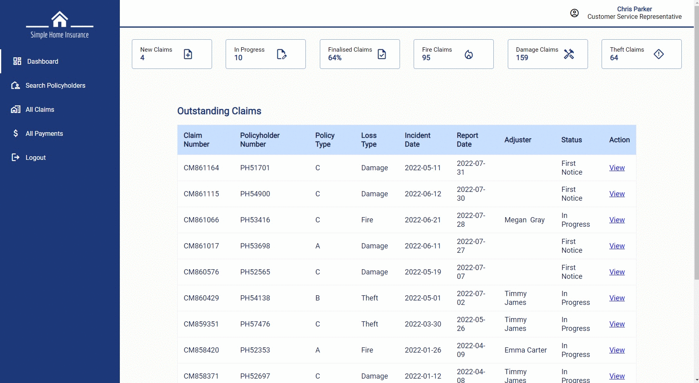
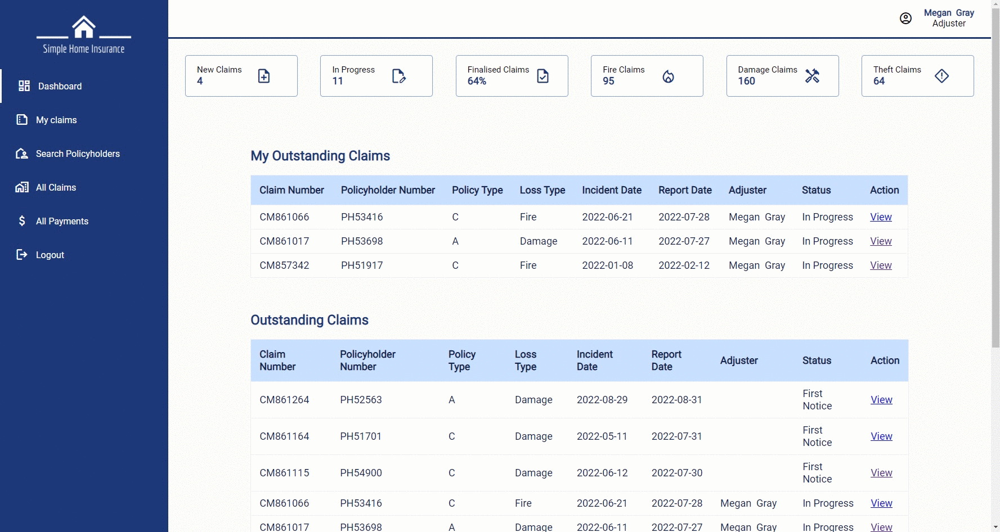
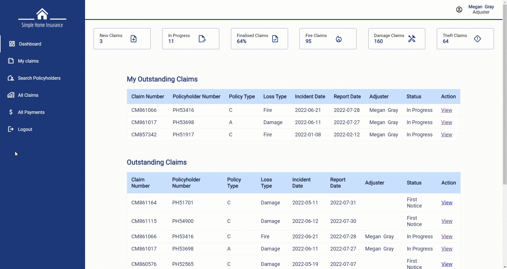

# Claims Management System

This claims management system is a web application based on the Spring framework. The application is built using Spring Boot and Maven. The front-end uses JSP, JSTL tags, HTML and CSS. Hibernate Validator is used to provide user input validation and Spring Security is used for authentication. The application connects to a MySQL database and uses the Hibernate framework to provide object-relational mapping. Passwords in the database are encrypted using the bcrypt algorithm.

## Tools and Technologies
* Java 1.8
* Spring Boot
* Spring MVC
* Spring Security
* Hibernate ORM
* Hibernate Validator
* JDBC
* MySQL
* JSP and JSTL
* HTML and CSS
* Maven
* Git

## Entity Relationship Diagram

  

## Background

Simple Home Insurance needs a system to provide a simple way for its employees to manage policyholder claims efficiently. It should allow employees to create, view, decline and finalise claims. In addition, employees should be able record payments for approved claims. This claims management system will attempt to meet these requirements.

## Features

The claims management system has two actors: 

**Customer service representatives**: A user that has the responsibility of creating new claims on behalf of policyholders. They record all the relevant details of claims on a form and save it on the system. 

**Adjusters**: A user that manages claims by viewing the details of the claim, investigating the claim, and making a final decision. An adjuster can either decline a claim or approve and finalise a claim by recording the payment amount on the system. The adjuster can also view a list of all the claims they have managed.

Both actors can:
* search for policyholders
* view a list of all claims
* view all claim payments

## Demonstration

### Viewing all claims and claim payments:

### A customer service representative creating a new claim:

### An adjuster declining a claim:

### An adjuster finalising a claim:

